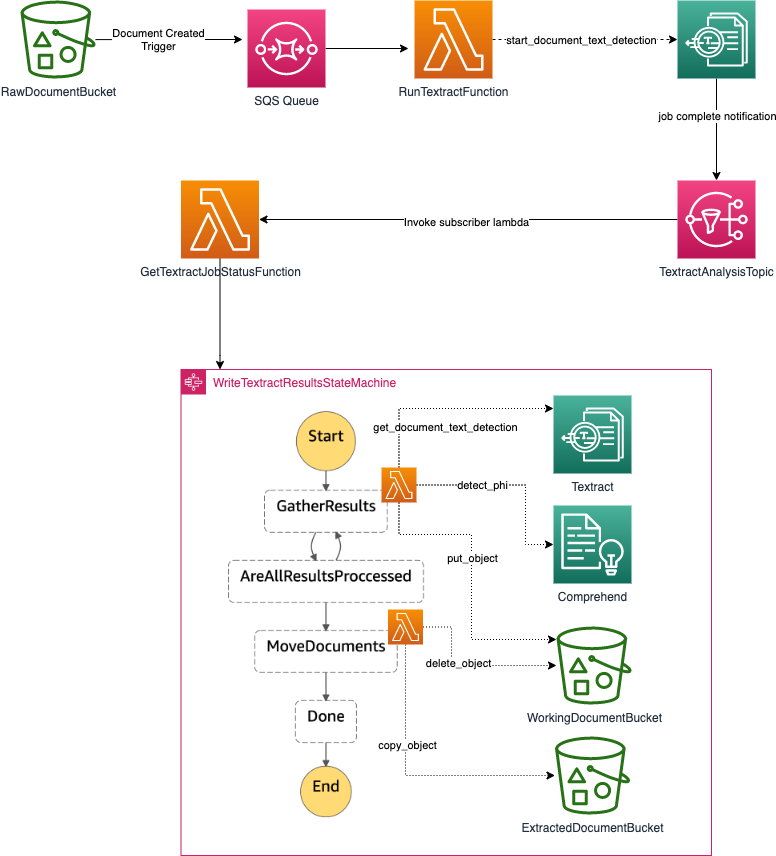

# scrub-pii-poc
POC to see if comprehend medical can be used to redact pii data wihtin recommendation letters processed by textract

## Deploying the stack
* Clone the repository
* Open a terminal and configure the bucket name of your target Amazon S3 distribution bucket and region where you'd like to deploy
```
export SOLUTION_NAME=textract-comprehend-medical-pii-poc
export DIST_OUTPUT_BUCKET=<S3 bucket to deploy the solution>
export VERSION=1.0.0
export AWS_REGION=<region where you would like to deploy the solution>
```
_Note:_ You have to manually create an S3 bucket with the name "$DIST_OUTPUT_BUCKET-$AWS_REGION"; 

* Next make the deploy script executable and run it
```
cd ./deployment
chmod +x ./deploy.sh  \n
./deploy.sh
```
## Architecture



* Documents are uploaded to the RawDocumentBucket
* RunTextFunction is triggered by the document creation
    * Document is asynchronously processed by Textract
* Textract publishes a notification to the TextractAnalysisTopic
* GetTextractJobStatusFunction is invoked through an SNS subscription to the TextractAnalysisTopic
    * If the Textract job was successful the JobId is submitted to the WriteTextractResultsStateMachine
* The GetTextractResultsFunction uses the JobId and the NextToken (if present) to process a page of textract results. 
    * It groups the LINE and WORD results into groups of ~100 characters and then runs them through Comprehend Medical to detect PII.
        * If PII is detected the word(s) are replaced with "<TYPE_OF_PII>"
    * Once all blocks in the page are processed the scrubbed text is written to a working document in s3. This is because there is a character limit on the input/output that step functions can pass around.
    * GetTextractResultsFunction then outputs the following data
    ```json
    {
        "job_id": "The textract Job Id",
        "next_token": "The textract job next page token, if available",
        "continue": "Boolean whether indicating wheter there are more pages to process",
        "document": {
            "Bucket": "Working document s3 bucket",
            "Key": "Working document s3 key"
            
        }
        
    }
    ```
    * AreAllResultsProcessed checks $.continue 
        * If true go back to GetTextractResultsFunction and process the next page
        * If false go to MoveDocuments
    * MoveDocuments copies the working document to the ExtractedDocumentBucket and delete the working copy out of the WorkingDocumentBucket
        

Copyright 2019 Amazon.com, Inc. or its affiliates. All Rights Reserved.

Licensed under the Apache License Version 2.0 (the "License"). You may not use this file except in compliance with the License. A copy of the License is located at

    http://www.apache.org/licenses/

or in the "license" file accompanying this file. This file is distributed on an "AS IS" BASIS, WITHOUT WARRANTIES OR CONDITIONS OF ANY KIND, express or implied. See the License for the specific language governing permissions and limitations under the License.
